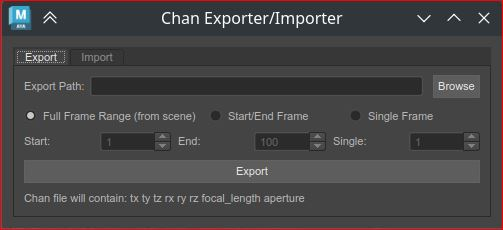
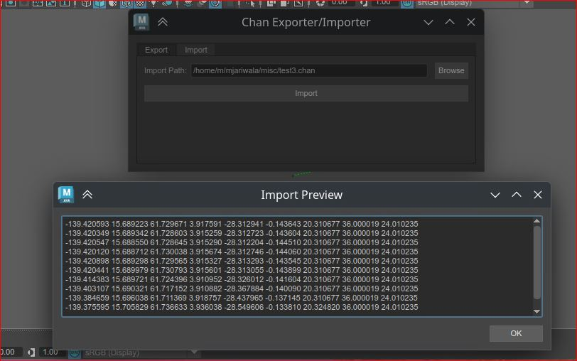

# Chan I/O Tool

A DCC-agnostic utility for exporting and importing `.chan` camera animation files across **Maya**, **Nuke**, and **3DEqualizer**.

[](https://github.com/montujj/chan-io/actions/workflows/ci.yml)

---

## Screenshots

**Export Tab** — set export path, frame range mode, and export to `.chan`



**Import Tab** — select a `.chan` file and preview data before applying to a camera node



---

## Supported DCCs
- Autodesk Maya
- Foundry Nuke
- 3DEqualizer (coming soon)

---

## .chan File Format
Each line in the `.chan` file contains:
```
tx ty tz rx ry rz focal_length h_aperture v_aperture
```

---

## Installation

Clone the repo and install dependencies:
```bash
git clone https://github.com/montujj/chan-io.git
cd chan-io
pip install -r requirements.txt
pip install -e .
```

---

## Usage

### Auto-detect DCC (recommended)
```python
import chan
chan.ui()
```
The tool will automatically detect whether you are running in Maya or Nuke.

### Maya (explicit)
```python
import chan
from chan.maya_io import backend as maya_backend
chan.ui(backend=maya_backend)
```

### Nuke (explicit)
```python
import chan
from chan.nuke_io import backend as nuke_backend
chan.ui(backend=nuke_backend)
```

---

## Features
- Export camera animation to `.chan` file from Maya or Nuke
- Import `.chan` file and apply animation to a camera node
- Supports full frame range, start/end range, or single frame export
- Auto-detects DCC environment on launch
- Clean PySide2 UI with Export and Import tabs
- Preview imported data before applying

---

## Project Structure
```
chan-io/
├── .github/
│   └── workflows/
│       └── ci.yml          # CI/CD pipeline
├── chan/
│   ├── __init__.py         # Package entry point and UI launcher
│   ├── dcc_interface.py    # Abstract base class for DCC backends
│   ├── maya_io.py          # Maya-specific backend
│   ├── nuke_io.py          # Nuke-specific backend
│   └── _ui.py              # PySide2 UI (internal)
├── tests/
│   ├── __init__.py
│   ├── test_dcc_interface.py
│   ├── test_maya_io.py
│   └── test_nuke_io.py
├── .gitignore
├── README.md
├── requirements.txt
└── setup.py
```

---

## Running Tests
```bash
pytest tests/ -v
```

---

## Requirements
- Python 3.7+
- PySide2
- Maya 2020+ or Nuke 13+ (for production use)

---

## Author
**Montu Jariwala** — Senior VFX Pipeline TD  
Website: [montujj.netlify.app](https://montujj.netlify.app/)  
LinkedIn: [linkedin.com/in/montu](http://www.linkedin.com/in/montu/)  
IMDB: [imdb.com/name/nm1983276](https://www.imdb.com/name/nm1983276/)

---

## License
MIT
